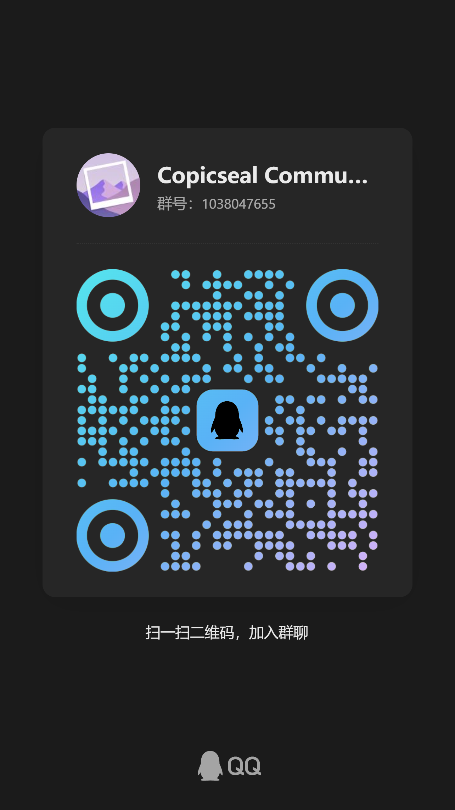
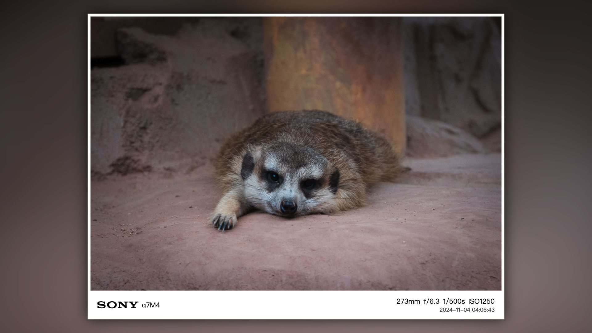
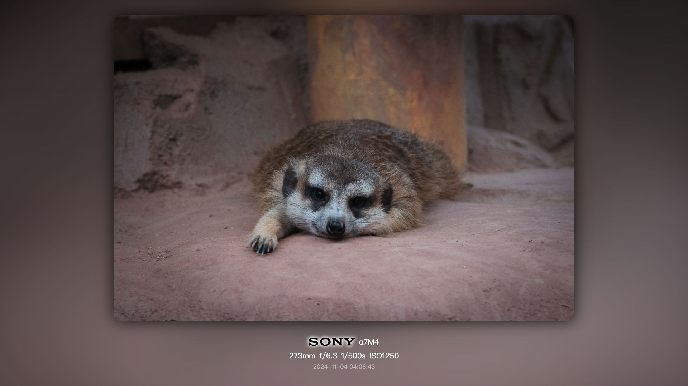
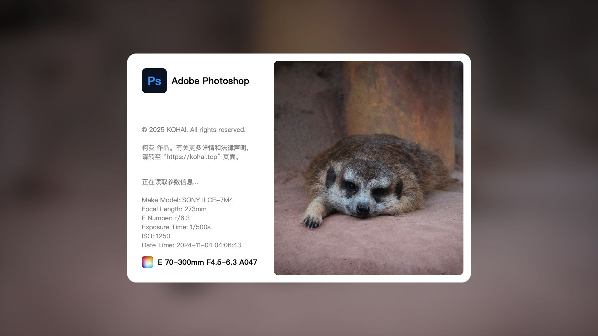

## ✨ 功能亮点

- 🖼️ **图像水印**：支持添加自定义水印样式，可调整位置、大小与透明度，批量处理无压力。
- 📷 **EXIF 读取**：自动解析照片元信息，展示快门、ISO、焦距等拍摄参数，支持选择性显示。
- ⚡ **所见即所得**：实时预览水印效果，调整参数，极简操作快速上手。
- 💻 **跨平台支持**：兼容 Windows 与 macOS，保证一致体验。
- 📦 **极简安装**：单文件安装，零依赖，启动迅速。
- 🔄 **持续优化中**：功能持续更新，欢迎反馈建议与贡献。

## 🖥️ 软件截图

<picture>
  <source srcset="./static/screenshot01.webp" type="image/webp">
  
</picture>

## 📦 下载

👉 [前往 GitHub Releases 下载最新版 Copicseal](https://github.com/copicseal/copicseal/releases)

### ⬇️ 代理下载
- [Windows 下载](https://copicseal-updater.kohai.top/download?platform=win32)
- [MacOS 下载](https://copicseal-updater.kohai.top/download?platform=darwin)

## 💬 常见问题

### Q: macOS 安装后提示「应用已损坏」怎么办？

由于 mac 应用未经过 Apple 公证，初次打开时可能会提示“应用已损坏”或无法验证开发者。可以通过以下命令跳过 Gatekeeper 校验：

```bash
sudo xattr -rd com.apple.quarantine /Applications/Copicseal.app
```

## 社区交流

⚠️ 温馨提示：群聊仅限日常讨论和经验分享，如需反馈问题或提交新需求，请提交 Issue。

<table>
  <thead>
    <tr>
      <th width="33.3%">微信群</th>
      <th width="33.3%">QQ 群</th>
      <th width="33.3%"></th>
    </tr>
  </thead>
  <tbody>
    <tr>
      <td>
        <picture>
          
        </picture>
      </td>
      <td>
        <picture>
          
        </picture>
      </td>
    </tr>
  </tbody>
</table>

## 🖼️ 模板示例

### 1. 白色边框模板
<picture>
  <source srcset="./static/templates/template01.webp" type="image/webp">
  
</picture>

### 2. 无框圆角模板
<picture>
  <source srcset="./static/templates/template02.webp" type="image/webp">
  
</picture>

### 3.1 PS 启动窗模板
<picture>
  <source srcset="./static/templates/template03_00.webp" type="image/webp">
  
</picture>


> 更多请前往 [Copicseal 官网](https://copicseal.kohai.top) 查看


## ⭐ Star History

<a href="https://www.star-history.com/#copicseal/copicseal&Date">
 <picture>
   <source media="(prefers-color-scheme: dark)" srcset="https://api.star-history.com/svg?repos=copicseal/copicseal&type=Date&theme=dark" />
   <source media="(prefers-color-scheme: light)" srcset="https://api.star-history.com/svg?repos=copicseal/copicseal&type=Date" />
   
 </picture>
</a>
